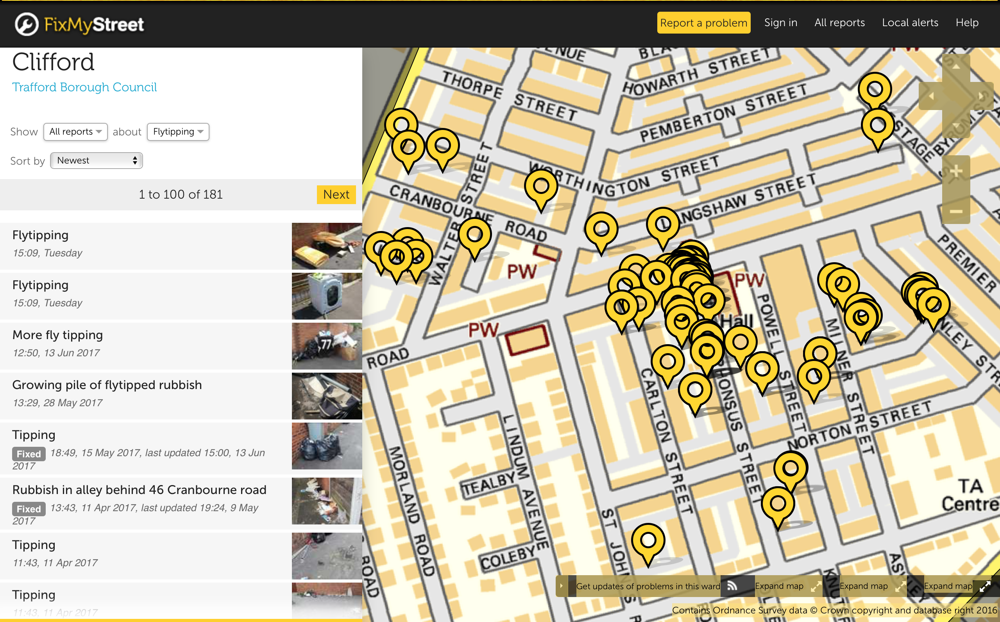

```{r setup, include=FALSE}
options(htmltools.dir.version = FALSE)

library(widgetframe); library(sf) ; library(tidyverse) ; library(leaflet) ; library(RColorBrewer); library(ggplot2) ; library(hrbrthemes) ; library(waffle)

# Clifford ward
clifford_ward <- st_read("data/clifford_ward.geojson", stringsAsFactors = F, quiet = TRUE)

# Trafford wards
trafford_wards <- st_read("data/trafford_wards.geojson", stringsAsFactors = F, quiet = TRUE)

# Neighbouring wards
neighbouring_wards <- st_read("data/neighbouring_wards.geojson", stringsAsFactors = F, quiet = TRUE)

# Population density data
ward_pop <- read_csv("data/trafford_ward_pop_estimates.csv")

# Car or van availability data
ward_car <- read_csv("data/trafford_ward_KS404EW.csv")

# IMD data
imd <- st_read("data/trafford_lsoa_imd.geojson", stringsAsFactors = F, quiet = TRUE)

# ASB data
asb <- read_csv("data/clifford_crime_data_2016-17.csv") %>% 
  filter(`Crime type` == "Anti-social behaviour") %>%  
  st_as_sf(crs = 4326, coords = c("Longitude", "Latitude")) 

# Key roads
cornbrook <- st_read("data/cornbrook_park_road.geojson", stringsAsFactors = F, quiet = TRUE) %>% st_zm() 

# GM Accessibility Levels and transport infrastructure
gmal <- st_read("data/clifford_gmal.geojson", stringsAsFactors = F, quiet = TRUE)
metro <- read_csv("data/TfGMMetroRailStops.csv") %>% 
  st_as_sf(crs = 27700, coords = c("GMGRFE", "GMGRFN")) %>% 
  st_transform(4326)
bus <- st_read("data/clifford_bus_routes.geojson", stringsAsFactors = F, quiet = TRUE)
```

## Structure of presentation
- Overview of Clifford ward
- Anti-social behaviour
- Transport
- Clifford's strengths

---
background-image: url(https://assets-cdn.github.com/images/modules/logos_page/GitHub-Mark.png)
background-size: 100px
background-position: 50% 37%
class: center, middle

All of the data used in this presentation is 'open data' and the R code which drives it is available on [GitHub](https://github.com/rcatlord/clifford)

---
## Clifford ward and its neighbours

Clifford ward sits at the northeastern tip of Trafford and is surrounded by 7 other wards    
<br>

```{r, echo=FALSE}
factpal <- colorFactor("Set2", neighbouring_wards$CTYUA12NM)
labels <- sprintf("<strong>%s</strong><br/>%s", neighbouring_wards$WD11NM, neighbouring_wards$CTYUA12NM) %>% lapply(htmltools::HTML)

leaflet() %>% 
  addTiles(urlTemplate = "http://{s}.basemaps.cartocdn.com/light_all/{z}/{x}/{y}.png",
           attribution = '&copy; <a href="http://www.openstreetmap.org/copyright">OpenStreetMap</a> &copy; <a href="https://carto.com/attribution">CartoDB</a> |<a href="https://www.ons.gov.uk/methodology/geography/licences"> Contains OS data © Crown copyright and database right (2017)</a>',
           options = tileOptions(minZoom = 11, maxZoom = 14)) %>% 
  addPolygons(data = trafford_wards, 
              fillColor = "#dfc27d",
              weight = 2, opacity = 1, color = "#636363") %>% 
    addPolygons(data = neighbouring_wards, 
              fillColor = ~factpal(CTYUA12NM), fillOpacity = 0.6, 
              weight = 2, opacity = 1, color = "#636363", dashArray = "3",
              highlight = highlightOptions(weight = 5, color = "white", dashArray = "", bringToFront = TRUE), 
              label = labels, labelOptions = labelOptions(style = list("font-weight" = "normal", padding = "3px 8px"), textsize = "15px", direction = "auto"), 
              group = "Neighbouring wards")  %>% 
  addLayersControl(overlayGroups = "Neighbouring wards", 
                   options = layersControlOptions(collapsed = FALSE)) %>% 
  hideGroup("Neighbouring wards") %>% 
  addEasyButton(easyButton(icon='fa-home', title='Reset',
    onClick=JS("function(btn, map){ map.setView([53.4618780226, -2.267604333], 12);}"))) %>%
  frameWidget(height='325')
```

---
## Population: density
- Clifford ward has the highest population density of all Trafford's wards: **65 residents per hectare**
- Of Trafford's LSOAs, Henrietta Street / Prestage Street (E0100611) has the highest population density: **160.9 residents per hectare**

```{r, echo=FALSE, fig.height=4.5}
ggplot(ward_pop, aes(x = reorder(WD11NM, pop_density), y = pop_density)) +
  geom_col(fill = "#43a2ca") +
  labs(x = "", y = "Population density (hectares)",
       title = "Population density by Trafford ward",
       subtitle = "Mid year 2015 estimates", 
       caption = "Source: ONS") + 
  theme_ipsum_rc(grid = "Y") +
  theme(axis.text.x = element_text(angle = 90, hjust = 1))
```

---
## Population: children and young people
- Clifford ward has the second highest percentage of residents aged 0-16 years: **25.3%**
- Of Trafford's LSOAs, Henrietta Street / Prestage Street (E0100611) has the second highest percentage of residents aged 0-16 years: **33.1%**

```{r, echo=FALSE, fig.height=4.5}
ward_pop %>% 
  mutate(percent = Population_MYE2015_AllPeople_Age_0_16_PercTotalPopulation/100) %>% 
  ggplot(aes(x = reorder(WD11NM, percent), y = percent)) +
  geom_col(fill = "#d95f0e") +
  scale_y_percent() +
  labs(x = "", y = "% of population aged 0-16 years",
       title = "% aged 0-16 years by Trafford ward",
       subtitle = "Mid year 2015 estimates", 
       caption = "Source: ONS") + 
  theme_ipsum_rc(grid = "Y")  +
  theme(axis.text.x = element_text(angle = 90, hjust = 1))
```

---
## Main language spoken
75.2% of people living in Clifford speak English. The other top languages spoken are 5.0% Gujarati, 4.9% Urdu, 2.4% Polish, 2.3% Panjabi, 1.9% Arabic, and 1.5% Somali. 61 other languages are spoken.

```{r, echo=FALSE, fig.height=4.5}
diversity <- c(`English`=8464, `Gujarati`=564, `Urdu`=555, `Polish`=273, `Panjabi`=264, `Arabic`=216, `Somali`=172,
`Other languages (61)`=746)
waffle(round((diversity/11254)*100,0), rows=5, size=0.5,
       title = "Main languages spoken in Clifford", 
       xlab = "1 square = 1% of residents",
       legend_pos="bottom")
```

Source: 2011 Census
---
## Index of Multiple Deprivation
Chorlton Road (E01006109) is amongst the 10% most deprived neighbourhoods in the country. It is ranked **1,798** out of 32,844 LSOAs in England.
```{r, echo=FALSE}
pal <- colorFactor(c("#800026","#bd0026","#e31a1c","#fc4e2a","#fd8d3c","#feb24c",
                     "#fed976","#ffeda0","#ffffcc","#ffffe5"), domain = 1:10, ordered = TRUE)
labels <- sprintf("<strong>%s</strong><br/>Rank: %s", imd$lsoa11cd, imd$rank) %>% lapply(htmltools::HTML)

leaflet() %>% 
  addTiles(urlTemplate = "http://{s}.basemaps.cartocdn.com/light_all/{z}/{x}/{y}.png",
           attribution = '&copy; <a href="http://www.openstreetmap.org/copyright">OpenStreetMap</a> &copy; <a href="https://carto.com/attribution">CartoDB</a> |<a href="https://www.ons.gov.uk/methodology/geography/licences"> Contains OS data © Crown copyright and database right (2017)</a>',
           options = tileOptions(minZoom = 11, maxZoom = 14)) %>% 
  addPolygons(data = imd, 
              fillColor = ~pal(decile), fillOpacity = 0.6, 
              weight = 2, opacity = 1, color = "#636363", dashArray = "3",
              highlight = highlightOptions(weight = 5, color = "white", dashArray = "", bringToFront = TRUE), 
              label = labels, 
              labelOptions = labelOptions(style = list("font-weight" = "normal", padding = "3px 8px"), textsize = "15px", direction = "auto")) %>% 
  addLegend(position = "topright", 
          colors = c("#800026","#bd0026","#e31a1c","#fc4e2a","#fd8d3c","#feb24c",
                     "#fed976","#ffeda0","#ffffcc","#ffffe5"),
          title = "Deciles of deprivation",
          labels = c("10% most deprived", 
                     "2","3","4","5","6","7","8","9",
                     "10% least deprived"), opacity = 1) %>% 
  addEasyButton(easyButton(icon='fa-home', title='Reset',
    onClick=JS("function(btn, map){ map.setView([53.4618780226, -2.267604333], 13);}"))) %>%
  frameWidget(height='325')
```

---
class: center, middle, inverse
# Anti-social behaviour

---
## Geographic spread
Personal, environmental and nuisance anti-social behaviour around [Cornbrook Park Road](https://www.google.co.uk/maps/place/Cornbrook+Park+Rd,+Stretford,+Manchester/@53.4674173,-2.2675008,17z/data=!3m1!4b1!4m5!3m4!1s0x487bae1d405a8b2d:0x52e52248c034fd04!8m2!3d53.4674173!4d-2.2653068) is the local policing priority for [Clifford South](https://www.police.uk/greater-manchester/MC25/priorities/).


```{r, echo=FALSE}
labels <- sprintf("<strong>%s</strong><br/>%s", asb$Month, asb$Location) %>% lapply(htmltools::HTML)
leaflet() %>% 
  setView(-2.265374, 53.467806, zoom = 16) %>% 
  addTiles(urlTemplate = "http://{s}.basemaps.cartocdn.com/light_all/{z}/{x}/{y}.png",
           attribution = '&copy; <a href="http://www.openstreetmap.org/copyright">OpenStreetMap</a> &copy; <a href="https://carto.com/attribution">CartoDB</a>, <a href="https://www.ons.gov.uk/methodology/geography/licences">| Contains OS data © Crown copyright and database right (2017)</a>',
           options = tileOptions(minZoom = 13, maxZoom = 17)) %>% 
  addPolygons(data = clifford_ward, 
              fillColor = "#dfc27d",
              weight = 2, opacity = 1, color = "#636363") %>% 
  addPolylines(data = cornbrook, color = "red", weight = 4, group = "Cornbrook Park Road") %>% 
  addCircleMarkers(data = asb, radius = 5, stroke = TRUE,
                   color = "red", weight = 3, opacity = 0.8, fillColor = "white",
                   label = labels,
                   clusterOptions = markerClusterOptions(
                     zoomToBoundsOnClick = TRUE,
                     spiderfyOnMaxZoom = TRUE, 
                     maxClusterRadius = 50)) %>% 
  addLayersControl(overlayGroups = "Cornbrook Park Road", 
                   options = layersControlOptions(collapsed = FALSE)) %>% 
  hideGroup("Cornbrook Park Road") %>% 
  addEasyButton(easyButton(icon='fa-home', title='Reset',
                           onClick=JS("function(btn, map){ map.setView([53.4618780226, -2.267604333], 13);}"))) %>% 
  frameWidget(height='325')
```

---
layout: true
background-image: url(img/cornbrook_park_road.png)
background-size: cover
class: center, bottom, inverse
## Cornbrook Park Road
---

---
layout: false
## Fly-tipping
**28** reports of fly-tipping in Clifford ward on [fixmystreet.com](https://www.fixmystreet.com/reports/Trafford/Clifford?filter_category=Flytipping&sort=created-desc) since January 2017. The majority are reported along alleyways linking Alphonsus Street.
<br>
<br>

<div align="center">

</div>

---
## Opportunities
- *Quickly clear fly-tipping:* following '[broken windows](https://www.theatlantic.com/magazine/archive/1982/03/broken-windows/304465/)' theory this helps to prevent areas from attracting further illegal waste dumping and other more serious crimes
- *Increase alleygating*: known to reduce burglary and prevent environmental anti-social behaviour such as fly-tipping and graffiti
- *Strict enforcement*: issue fixed penalty notices for [small scale fly-tipping offences](http://www.legislation.gov.uk/uksi/2016/334/note/made)
- *Review waste collection services*: empty clothes recycle bins regulalry, offer a limited free bulky waste collection service
- *School engagement with police support*: discourage littering at an early stage

---
class: center, middle, inverse
# Transport

---
## Car availability
43.2% of households in Clifford are without a car compared with 9.5% of households in Hale Barns ward.

```{r, echo=FALSE, fig.height=4.5}
ggplot(ward_car, aes(x = reorder(WD11NM, KS404EW0008), y = KS404EW0008)) +
  geom_col(fill = "#c51b8a") +
  labs(x = "", y = "% of households",
       title = "Percent of households without a car by Trafford ward",
       subtitle = "2011 Census", 
       caption = "Source: ONS") + 
  theme_ipsum_rc(grid = "Y")   +
  theme(axis.text.x = element_text(angle = 90, hjust = 1))
```

---
layout: true
background-image: url(img/cornbrook_metrolink.png)
background-size: cover
class: center, bottom, inverse
## Cornbrook Metrolink Station
---

---
layout: false
## Greater Manchester Accessibility Levels

GMAL is a measure which rates locations by their distance from frequent public transport services    
<br>

```{r, echo=FALSE}
pal <- colorFactor(c("#084594","#4292c6","#9ecae1","#deebf7","#ffffb3",
                     "#fdb462","#e41a1c","#a65628"), domain = 1:8, ordered = TRUE)
icon <- awesomeIcons(icon = 'fa-train', iconColor = 'black', library = 'fa')


leaflet() %>% 
  setMaxBounds(-2.283896, 53.45055, -2.253023, 53.47271) %>% 
  addTiles(urlTemplate = "http://{s}.basemaps.cartocdn.com/light_all/{z}/{x}/{y}.png",
           attribution = '&copy; <a href="http://www.openstreetmap.org/copyright">OpenStreetMap</a> &copy; <a href="https://carto.com/attribution">CartoDB</a> |<a href="https://www.ons.gov.uk/methodology/geography/licences"> Contains OS data © Crown copyright and database right (2017)</a>',
           options = tileOptions(minZoom = 13, maxZoom = 17)) %>% 
  addPolygons(data = gmal,
              fillColor = ~pal(GMALLevel), fillOpacity = 0.5, 
              stroke = FALSE) %>% 
  addPolygons(data = clifford_ward, 
              fillColor = "#dfc27d",
              weight = 2, opacity = 1, color = "#636363") %>%
  addAwesomeMarkers(data = metro, icon = icon, label=~as.character(RSTNAM), group = "Metrolink and Rail stations") %>% 
  addPolylines(data = bus, color = "red", weight = 1, group = "Bus routes") %>% 
  addLayersControl(
    overlayGroups = c("Metrolink and Rail stations", "Bus routes"),
    options = layersControlOptions(collapsed = FALSE)) %>% 
  hideGroup(c("Metrolink and Rail stations", "Bus routes")) %>% 
  addEasyButton(easyButton(icon='fa-home', title='Reset',
                           onClick=JS("function(btn, map){ map.setView([53.4618780226, -2.267604333], 13);}"))) %>% 
  addLegend(position = "bottomright", 
            colors = c("#084594","#4292c6","#9ecae1","#deebf7","#ffffb3","#fdb462","#e41a1c","#a65628"),
            title = "GM Accessibility Level",
            labels = c("1 Low accessibility", 
                       "2","3","4","5","6","7",
                       "8 High accessibility"), opacity = 0.5) %>% 
  frameWidget(height='325')
```

---
## Opportunities
- *Make Cornbrook Metrolink station safe*: Increase natural surveillance and clear graffiti / litter
- *Improve access to Cornbrook Metrolink station*: explore other Bridgewater Way crossing options
- *Improve crossing safety*: check Bridgewater Way crossing to Cornbrook Metrolink station  
- *Explore bus routes and timetables*
- *Increase cycling*: cycle hire, training, ride-to-work schemes, cycle paths

---
class: center, middle, inverse
# Clifford's strengths

---
layout: true
background-image: url(img/hullard_park.png)
background-size: cover
class: center, bottom, inverse
## Green spaces (Hullard Park)
---

---
layout: true
background-image: url(img/limelight.png)
background-size: cover
class: center, bottom, inverse
## High quality new builds (Limelight development)
---

---
layout: true
background-image: url(img/minaret.png)
background-size: cover
class: center, bottom, inverse
## Culturally rich (Jame'ah Masjid E Noor)
---

---
layout: true
background-image: url(http://upandforward.recycleforgreatermanchester.com/wp-content/uploads/2015/03/JFP3400.jpg)
background-size: cover
class: center, bottom, inverse
## Young population (Seymour Park Primary)
---

---
layout: false
## Data sources

- Vector boundary data: <http://geoportal.statistics.gov.uk>
- 2011 Census: <http://infuse.ukdataservice.ac.uk/infusewiz.aspx?cookie=openaccess> and <https://www.nomisweb.co.uk/census/2011>
- English indices of deprivation 2015: <http://opendatacommunities.org/def/concept/folders/themes/societal-wellbeing>
- Flytipping reports to Trafford Council: <https://www.fixmystreet.com/reports/Trafford/Clifford?filter_category=Flytipping&sort=created-desc>
- Police recorded crime data: <https://data.police.uk/data/>
- GM Accessibility Levels: <https://data.gov.uk/dataset/gm-accessibility-levels>
- Metrolink stops: <https://mappinggm.org.uk/metadata.htm>
- Manchester bus routes: <https://mappinggm.org.uk/metadata.htm>

---
class: center, middle, inverse
# Questions?
